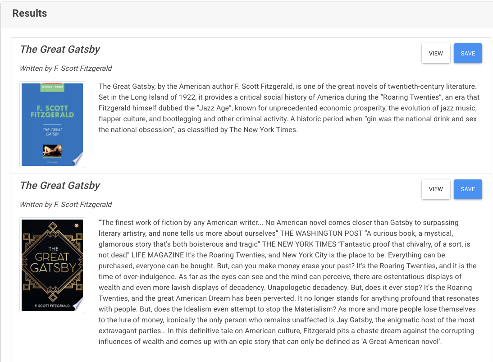
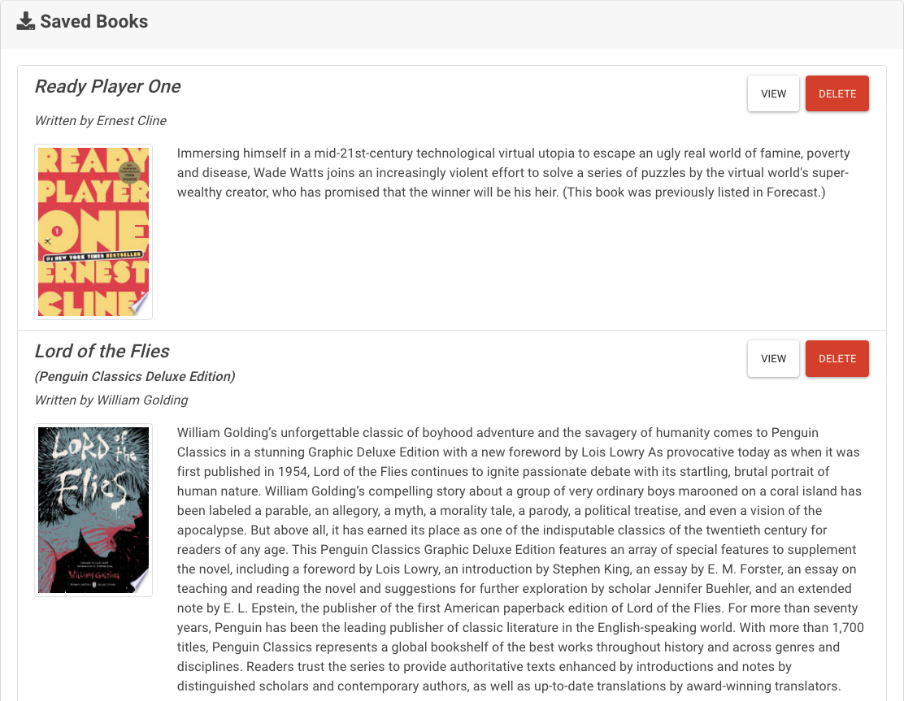
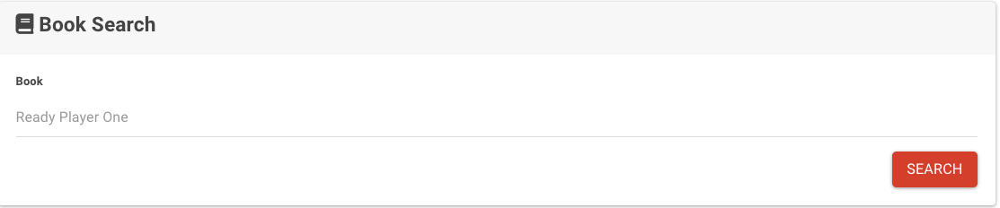

# google-books

## Description
This repository contains the code used to create a React-based Google Books search application. The app allows users to easily obtain information for any searched book and save books of interest. 

## Technologies
* Javascript
* React
* mongodb
* html
* css

## Dependencies
* axios
* react-dom
* react
* react-scripts
* express
* mongoose
* if-env

## Installation
In order to install necessary dependencies, please run the following command: npm i

## Features
Allows users to:
* search for books by title
* recieve relevant information regarding a specific book
* save books of interest in a personal library
* delete books out of their saved library

## Preview

Results populated from book search

Library of saved books

Search function